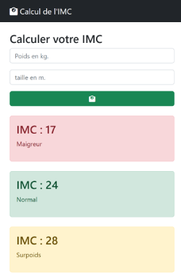

# TP 02 - Calul de l'imc avec couleur
## :warning: La correction

  


<code>app.components.html</code>

```html
<div class="container">
  <div class="row">
    <div class="col-4 pt-4">
      <h1 class="h3">Calculer votre IMC</h1>
      <label for="poids">Poids en kg.</label>
      <input type="text"
      class="form-control"
      [(ngModel)]="poids" placeholder="Poids en kg">
      <label for="taille" class="mt-3">Taille en mètre</label>
      <input type="text"
      class="form-control"
      [(ngModel)]="taille" placeholder="Taille en m.">
      
      <button (click)="onCalculer()" class="btn btn-success mt-3 col-12">
        <i class="fa-solid fa-weight-scale"></i>
      </button>


      @if(imcAfficher.length > 0){
      <div class="alert my-3" [class]="myClasse">
        <div>IMC : {{imcAfficher}}</div>
        <div>{{ tranche }}</div>
        @if(objectif.length > 0) {
        <div>{{ objectif }}</div>
        }
      </div>
      }
    </div>
  </div>
</div>

```


<code>app.components.ts</code>

```ts
import { CommonModule } from '@angular/common';
import { Component } from '@angular/core';
import { FormsModule } from '@angular/forms';


//import { RouterOutlet } from '@angular/router';

// décorateurs
@Component({
  selector: 'app-root',
  imports: [FormsModule,CommonModule],
  templateUrl: './app.component.html',
  styleUrl: './app.component.scss'
})
export class AppComponent {
  poids ='';
  taille= '';
  imcAfficher = '';
  tranche='';
  objectif='';
  myClasse='';
  onCalculer():void{
    const imc = Number(this.poids) / (Number(this.taille) *Number(this.taille));
    this.objectif='';
    this.imcAfficher= imc.toFixed(1); '24.7'
    if  (isNaN(imc)){
      this.imcAfficher =''
    return
    }
    if (imc > 25){
      // objectif en surpoids
      const poidsIdeal = 25 *parseFloat(this.taille) *parseFloat(this.taille);
      console.log(poidsIdeal);
      const kilo = poidsIdeal - parseFloat(this.poids);
      this.objectif= 'Objectif :'+poidsIdeal.toFixed(1)+' kg ('+kilo.toFixed(1)+'kg)'; 
    }
    if (imc < 18.5){
      this.tranche = 'maigreur';
       const poidsIdeal = 18.5 *parseFloat(this.taille) *parseFloat(this.taille);
      const kilo = poidsIdeal - parseFloat(this.poids);
      this.objectif= 'Objectif :'+poidsIdeal.toFixed(1)+' kg (+'+kilo.toFixed(1)+'kg)';
      this.myClasse='alert-danger'
    }
    else if (imc <25){
      this.tranche = 'normal';
      this.myClasse='alert-success'
    }
    else if (imc <30){
      this.tranche = 'surpoids';
      this.myClasse='alert-warning'
    }
    else if (imc <35){
      this.tranche = 'obésité';
      this.myClasse='alert-danger'
    }
    else if (imc <40){
      this.tranche = 'obésité massive';
      this.myClasse='alert-secondary'
    }
    else{
      this.tranche = 'obésité morbide';
       this.myClasse='alert-primary'
    }
  this.poids = '';
    this.taille ='';

  } 
}

```