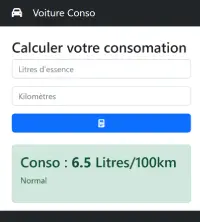

# TP 03 - Conso voiture partie 1
**Avec un formulaire**
## :warning: La correction


 
<code>app.components.ts</code>

```ts
import { CommonModule } from '@angular/common';
import { Component } from '@angular/core';
import { FormsModule, NgForm } from '@angular/forms';


//import { RouterOutlet } from '@angular/router';

// décorateurs
@Component({
  selector: 'app-root',
  imports: [FormsModule, CommonModule],
  templateUrl: './app.component.html',
  styleUrl: './app.component.scss'
})
export class AppComponent {
  conso = '';
  calculer(form: NgForm) {
    const litre: string = form.value['litre'];
    const km = form.value['km'];
    const conso2 = (Number(litre) * 100) / Number(km);
    this.conso = conso2.toFixed(1);
    form.reset();
  }

  getClass(): string {
    if (Number(this.conso) <= 7) {
      return 'alert-success'
    }
    if (Number(this.conso) < 9) {
      return 'alert-danger'
    }
    return 'alert-secondary'

  }
}
```

<code>app.components.ts</code>

```ts
<div class="container">
  <div class="row">
    <div class="col-4 pt-4">
      <h1 class="h3">Calculer votre consomation</h1>
      <form (ngSubmit)="calculer(formConso)" #formConso="ngForm">
        <input class="form-control" type="text" name="litre" placeholder="Litres" ngModel>

        <input class="form-control my-2" type="text" name="km" placeholder="Kilomètres" ngModel>
        <button class="btn btn-primary mt-3 col-12">
          <i class="fa-solid fa-calculator"></i>
        </button>
      </form>

      @if(conso.length >0){
      <div class="alert  mt-4" role="alert" [class]="getClass()">
        <h3>Conso : <b>{{conso}}</b> Litres/100km</h3>

      </div>
      }
    </div>
  </div>
</div>
```
